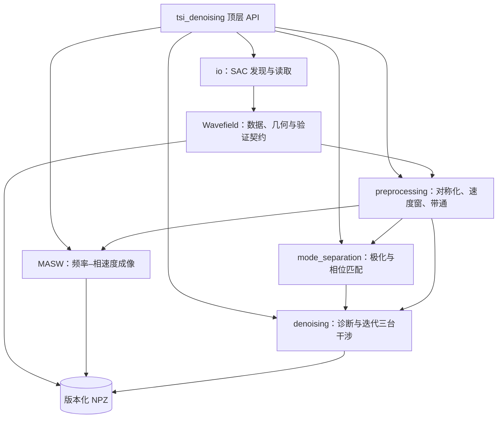
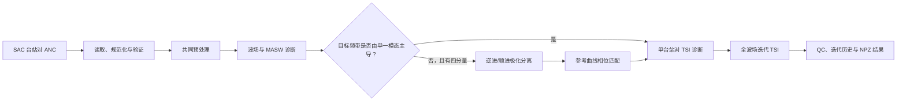
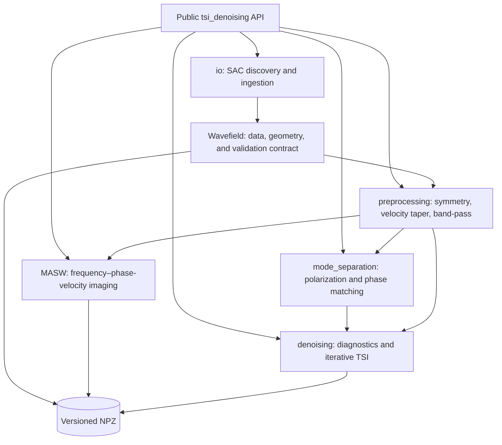
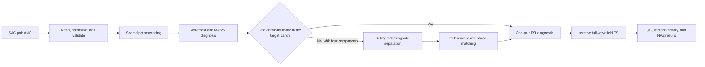

# TSI-Denoising

> 一维线性密集台阵高频面波模态分离与三台干涉去噪工具包  
> High-frequency surface-wave mode separation and three-station interferometry denoising for dense 1-D arrays

[](pyproject.toml)
[](LICENSE)

[中文说明](#中文说明) · [English](#english)

## 快速开始 / Quick start

```bash
git clone https://github.com/YuanYusung/TSI-Denoising.git
cd TSI-Denoising
python -m pip install ".[tutorial]"
python retrieve_datasets.py
jupyter lab tutorial/MARS_DAS/run_example_MARS_DAS.ipynb
```

教程总览见 [`tutorial/README.md`](tutorial/README.md)；
默认教程路径不要求 GUI，RR Array的手工频散曲线拾取是可选步骤。

The [tutorial overview](tutorial/README.md) contains the case-specific run
instructions. The default tutorial path is headless; interactive RR dispersion
picking is optional.

最短的程序化入口如下；它读取 MARS DAS 教学数据，执行共同预处理并计算 MASW 频散图。
The minimal programmatic entry point reads the MARS DAS teaching data, applies shared preprocessing, and computes a MASW image:

```python
from tsi_denoising import MASW, read_sac_directory

wavefield = read_sac_directory(
    "tutorial/MARS_DAS/input_public/RR"
).preprocess(fmin=0.5, fmax=3.5, vmin=0.1, vmax=2.0)
wavefield.print("MARS DAS / RR")

masw = MASW(wavefield, fmin=0.5, fmax=3.5).compute(n_jobs=1)
masw.print("MARS DAS / RR MASW")
masw.plot()
```

---

## 中文说明

### 1. 项目简介

TSI-Denoising 是一个面向科研和教学的 Python 程序包，用于处理一维线性密集台阵中的背景噪声互相关函数（ambient-noise cross-correlation，ANC）。程序将 ObsPy `Stream` 封装为经过验证的 `Wavefield` 处理对象，并提供从数据读取、预处理、频散分析、模态分离到三台干涉（three-station interferometry，TSI）迭代去噪的一套工作流。

它解决的是一个明确而有限的问题：当高频面波 ANC 受到非相干噪声或多模态混叠影响时，先建立可检查的数据与几何契约，再按数据条件选择模态分离和 TSI 去噪路径。项目当前版本为 `0.1.0`（Alpha）。

本仓库同时包含为**第十二届地震学算法和程序培训班**（2026 年 8 月 10–12 日）准备的两个教学案例：

- **MARS DAS**：海底 DAS 单模态 Scholte 波的 TSI 去噪，
- **RR Array**：跨断层密集台阵多模态瑞利波分离和分模态去噪。

| 教学案例 | 输入条件 | 主要流程 | 可检查产物 |
|---|---|---|---|
| [MARS DAS](tutorial/MARS_DAS/README.md) | 单分量 RR；48 个台站、1,128 个公开台站对 | 共同预处理 → MASW → TSI 诊断与迭代去噪 | 波场图、MASW 图、迭代历史、版本化 NPZ |
| [RR Array](tutorial/RR_Array/README.md) | ZZ/ZR/RZ/RR 四分量；每分量 23 个台站、253 个公开台站对 | 极化分离 → 相位匹配 → 分模态 TSI | 候选模态、参考频散曲线、M0/M1 去噪结果 |


> [!IMPORTANT]
> 公开教学输入数据不纳入代码仓库。运行 `python retrieve_datasets.py` 可下载并安全解压两个案例的 `input_public/` 数据；教程生成或复用的缓存位于 `processed/`。

### 2. 仓库结构

```text
TSI-Denoising/
├── src/tsi_denoising/              # Python 程序包
│   ├── io/                         # SAC 目录读取
│   ├── mode_separation/            # 极化与相位匹配分离
│   ├── denoising/                  # 三台干涉去噪
│   ├── wavefield.py                # Wavefield 数据模型
│   ├── preprocessing.py            # 共同预处理
│   └── masw.py                     # MASW 计算与绘图
├── tutorial/
│   ├── MARS_DAS/                   # Monterey 湾海底 DAS 单模态 Scholte 波案例
│   └── RR_Array/                   # 跨 San Jacinto 断裂带密集台阵多模态瑞利波案例
├── retrieve_datasets.py            # 公开教学数据下载脚本
├── retrieve_Trinode_demo.py        # 下载并安全解压 Trinode-demo 到仓库父目录
├── pyproject.toml                  # 包元信息及唯一依赖定义
└── README.md                       # 中英文总入口
```

### 3. 安装与数据准备

#### 3.1 获取程序

本项目通过 GitHub 分发。安装前请准备 [Git](https://git-scm.com/)。

~~~bash
git clone https://github.com/YuanYusung/TSI-Denoising.git
cd TSI-Denoising
~~~

#### 3.2 创建隔离环境并安装

项目要求 Python 3.10 或更高版本。`pyproject.toml` 是运行、教程和开发依赖的唯一定义来源。推荐先创建虚拟环境，再按用途安装：

~~~bash
python -m venv .venv
source .venv/bin/activate
python -m pip install --upgrade pip
python -m pip install ".[tutorial]"
~~~

`.[tutorial]` 安装程序包、JupyterLab、ipykernel 和 RR Array 可选交互拾取所需的 PyQt5。只使用 Python API、无需运行 Notebook 时，改用 `python -m pip install .`

#### 3.3 使用 Jupyter 与验证安装

若要在 Notebook 中明确选择该环境，请注册内核：

~~~bash
python -m ipykernel install --user --name tsi-denoising --display-name "Python (TSI-Denoising)"
~~~

打开教程 Notebook 后选择 `Python (TSI-Denoising)`。使用下列命令验证实际导入位置，并确认它未指向相邻的项目副本：

~~~bash
python -c "from pathlib import Path; import tsi_denoising; print(Path(tsi_denoising.__file__).resolve())"
~~~

#### 3.4 获取教学数据

公开 SAC 教学输入不随代码仓库发布。在项目根目录运行：

~~~bash
python retrieve_datasets.py
~~~

为便于公开教学并缩短普通电脑上的运行时间，脚本从公开分享归档下载约一半台站的均匀抽样数据，并只解压缺失的
`tutorial/RR_Array/input_public/` 和 `tutorial/MARS_DAS/input_public/`；已有目录不会被覆盖。
它不会重新映射 SAC 中的原始台站名；RR Array 的四个分量使用完全相同的台站子集，
并保留原始 `010` 与 `040` 台站及其与公开子集之间的台站对，供教程作为虚拟源或接收台站示例。
教程缓存写入 `processed/`。
当前公开子集的文件数量、采样信息和目录布局见
[`tutorial/data_manifest.yml`](tutorial/data_manifest.yml)。

### 4. 核心能力与输出

| 能力 | 解决的问题 | 主要输出 |
|---|---|---|
| SAC 读取与波场契约 | 统一 source/receiver、台站对方向、采样和距离元数据，并尽早拒绝不一致输入 | 经过验证的 `Wavefield` |
| 共同预处理 | 对称化正负相关时间，施加距离相关速度窗和零相位带通 | 可用于频散分析的波场 |
| MASW 频散诊断 | 使用相移叠加检查目标频带内的相速度能量分布 | 频率–相速度归一化能量图 |
| 多模态分离 | 组合四分量极化关系，并使用参考频散曲线执行相位匹配 | 逆进/顺进候选波场和目标模态波场 |
| 三台干涉去噪 | 汇集满足几何条件的第三台站干涉结果，对单个台站对诊断并对全波场迭代 | `DenoisingResult`、迭代变化和 QC 图 |
| 可重复性与缓存 | 将波场、MASW 和去噪诊断写入版本化压缩 NPZ，默认保护已有文件 | 可重新加载的中间产物和最终结果 |

### 5. 系统架构与处理流程

#### 5.1 程序包架构



`Wavefield` 是各模块共享的数据边界：读取阶段先规范化并验证 ObsPy Trace，后续模块围绕同一组台站对、距离、采样率和时间轴工作。用户应从 `tsi_denoising` 顶层导入公开接口，而不是依赖内部模块。

#### 5.2 核心工作流程



#### 5.3 技术栈

| 层级 | 技术 | 用途 |
|---|---|---|
| 语言与打包 | Python ≥ 3.10、setuptools、`pyproject.toml` | `src` 布局程序包、依赖定义和 wheel 构建；CI 当前检查 3.10 与 3.12 |
| 地震数据 | ObsPy ≥ 1.4 | SAC 读写、Trace/Stream 元数据和信号处理基础 |
| 数值计算 | NumPy ≥ 1.24、SciPy ≥ 1.10 | FFT、滤波、插值、数组运算与相位处理 |
| 可视化 | Matplotlib ≥ 3.7 | 波场、MASW、窄带和迭代诊断图 |
| 教学环境 | JupyterLab、ipykernel、可选 PyQt5 | 可复现教程与可选交互式频散曲线拾取 |
| 工程质量 | Ruff、GitHub Actions | 基础 lint 和 Python 3.10/3.12 wheel 检查 |


### 6. 适用范围与限制

本程序主要面向台站编号能够代表空间顺序的一维或近似一维阵列。TSI 假设目标面波主要沿阵列方向传播，并依赖不同台站组合之间稳定的几何和相位关系。

使用时需要注意：

- 二维台阵、弯曲测线或强横向不均匀介质可能不满足距离顺序和一维传播假设；
- 极化分离要求 ZZ、ZR、RZ、RR 四个分量具有相同台站对、距离、采样率和时间轴；
- ZR/RZ 符号、径向正方向和正负相关时间定义必须在数据制作阶段保持一致；
- MASW 振幅峰值不能自动确定模态阶次；应结合理论频散、极化特征与空间连续性进行判断；
- TSI 不会自动消除模态交叉项，多模态数据应先进行可靠的模态分离。

### 7. 输入数据要求

#### 7.1 SAC 波形

每个 SAC 文件必须只包含一个台站对的一条一维互相关波形。`read_sac_directory()` 会递归搜索目录，默认匹配大小写不同的 `.sac`、`.SAC` 和 `.SAC_s` 等名称。

| 信息 | 首选字段 | 回退字段 | 要求 |
|---|---|---|---|
| 虚拟源名 | `stats.sac.kevnm` | `stats.source` | 非空且含数字编号 |
| 接收台站名 | `stats.sac.kstnm` | `stats.station` | 非空且含数字编号 |
| 台间距 | `stats.sac.dist` | 无 | 有限正数，单位 km |
| 相关时间起点 | `stats.sac.b` | 无 | 有限数，单位 s |

同一 `Wavefield` 内的 Trace 必须具有相同的样本数、采样间隔与 `sac.b`；数据必须是一维有限实数数组；有向台站对不能重复；不同台站名不能映射到同一个数字编号。

#### 7.2 台站编号与方向规范化

程序使用台站名最后一组连续数字确定空间顺序：

| 名称 | 解析编号 |
|---|---:|
| `RR010` | 10 |
| `LINE2_ST040` | 40 |
| `DAS00345` | 345 |

构造 `Wavefield` 或调用 `read_sac_directory()` 时，程序会删除自相关、统一台站对为较小编号指向较大编号、去除重复的相反方向记录，并在必要时交换头段与反转波形。默认还会检查距离是否随对端编号严格增加。

对于弯曲测线、二维阵列或编号不代表空间位置的数据，请先用 ObsPy 读取为 `Stream`，再以 `check_distance_order=False` 构造 `Wavefield`。这只跳过距离顺序检查，不会放宽其他数据一致性要求。

#### 7.3 相关时间轴

互相关波形应覆盖目标面波所需的正、负相关时间。`preprocess_stream()` 与 `Wavefield.preprocess()` 会按正负时间分支进行对称化；若原始数据只有正时间半支，应先在负时间端补零，并正确设置 `sac.b`。

### 8. 推荐工作流

根 README 仅说明通用流程和接口；完整的可运行代码、参数选择、质量控制与结果解释见教程。

#### 8.1 单分量、单一主导模态数据

适用于目标频带内由单一面波模态主导的数据，例如 MARS DAS 案例中的 Scholte 波。

~~~text
读取 SAC 互相关波形
        |
构造并验证 Wavefield
        |
对称化、速度窗和带通滤波
        |
时间–距离波场与 MASW 频散诊断
        |
确认目标频带内由单一模态主导
        |
单台站对三台干涉诊断
        |
全波场迭代去噪与质量控制
~~~

完整步骤见 [MARS DAS Notebook](tutorial/MARS_DAS/run_example_MARS_DAS.ipynb)。

#### 8.2 四分量、多模态瑞利波数据

适用于具有 ZZ、ZR、RZ、RR 四分量互相关波形、且目标频带内存在多个瑞利波模态的数据。

~~~text
读取四分量 SAC 数据
        |
统一预处理与一致性检查
        |
波场与 MASW 频散诊断
        |
逆进–顺进极化分离
        |
相位匹配模态分离
        |
确认目标模态的空间与频散连续性
        |
各目标模态分别进行三台干涉去噪与质量控制
~~~

完整步骤见 [RR Array Notebook](tutorial/RR_Array/run_example_RR_Array.ipynb)。

> [!IMPORTANT]
> 极化分离不等同于模态分离。逆进或顺进波场仍可能包含多个模态。将波场输入三台干涉前，应结合频散谱、参考频散曲线与空间连续性确认目标模态已可靠分离。

### 9. 关键接口与参数参考

推荐始终从 `tsi_denoising` 顶层导入公开接口。除非另有说明，距离单位为 km、速度单位为 km/s、时间单位为 s、频率单位为 Hz。

#### 9.1 波场构造、读取与预处理

| 接口 | 参数 | 说明 |
|---|---|---|
| `Wavefield(stream, *, component=None, copy=True, check_distance_order=True)` | `stream` | 必填的非空 ObsPy `Stream`；所有 Trace 必须满足第 7 节规范。 |
|  | `component` | 可选分量标签，如 `"ZZ"` 或 `"RR"`；只作为元数据。 |
|  | `copy` | 默认 `True`，复制输入 Trace；仅在调用方自行管理原始 Stream 时使用 `False`。 |
|  | `check_distance_order` | 默认 `True`，要求编号与距离顺序相容；弯曲或二维阵列可设为 `False`。 |
| `read_sac_directory(directory, pattern=None, *, component=None)` | `directory` | 必填 SAC 根目录；递归读取并返回验证、规范化后的 `Wavefield`。 |
|  | `pattern` | 一个通配符或通配符序列；默认自动匹配常见 SAC 扩展名。 |
|  | `component` | 可选分量名；省略时采用目录名。 |
| `preprocess_stream(wavefield, fmin=0.5, fmax=5.0, vmin=0.1, vmax=2.5, taper_fraction=0.05)` | `wavefield` | 必填输入波场；返回新的 `Wavefield`，不修改输入。 |
|  | `fmin`、`fmax` | 零相位带通滤波下限与上限；要求 `0 < fmin < fmax < Nyquist`。 |
|  | `vmin`、`vmax` | 距离相关速度窗范围；因果窗为 `distance / vmax` 至 `distance / vmin`。 |
|  | `taper_fraction` | 速度窗两端 taper 比例，必须位于 0 至 0.5。 |
| `Wavefield.print(label="Wavefield", *, status=None)` | `label`、`status` | 打印台站、台站对、采样、时间轴和距离范围摘要；`status` 可附加缓存或处理状态。 |

`Wavefield.preprocess()` 使用同一组参数，但会原地替换对象内的数据并返回自身；需要保留原始波场时应使用 `preprocess_stream()`。

#### 9.2 MASW 频散分析

| 接口 | 参数 | 说明 |
|---|---|---|
| `MASW(wavefield, velocities=None, fmin=0.5, fmax=5.0, padding_factor=5, dist_threshold=0.2)` | `wavefield` | 必填、通常已预处理的输入波场；构造对象仅保存配置，须调用 `.compute()`。 |
|  | `velocities` | 相速度采样数组；省略时使用 0.2–2.5 km/s 的 231 点线性网格。 |
|  | `fmin`、`fmax` | MASW 频率范围；必须落在有效奈奎斯特频率内。 |
|  | `padding_factor` | FFT 零填充倍数，必须是不小于 1 的整数；增大仅加密频率采样。 |
|  | `dist_threshold` | 参与成像的最小台间距；小于该值的记录被排除。 |
| `MASW.compute(n_jobs=1)` | `n_jobs` | 频率行计算的进程数；从 1 开始验证，再按 CPU 与内存提高。 |
| `MASW.print(label="MASW")` | `label` | 打印已计算能量图的网格范围和最强归一化能量位置；调用前必须完成 `.compute()` 或加载已计算缓存。 |
| `compute_masw(wavefield, velomin=0.2, velomax=2.5, fmin=0.5, fmax=5.0, padding_factor=5, *, velocities=None, dist_threshold=0.2, n_jobs=1)` | `velomin`、`velomax` | 未提供 `velocities` 时生成 231 点线性速度网格的范围。 |
|  | 其余参数 | 与 `MASW` 构造参数和 `.compute(n_jobs=...)` 含义相同；直接返回 `(velocity, frequency, amplitude)`。 |

#### 9.3 极化与相位匹配模态分离

| 接口 | 参数 | 说明 |
|---|---|---|
| `polarization_separate(*, zz, rz, zr, rr, swap_polarization=False, use_rr=True, vmin=0.1, vmax=2.5, taper_fraction=0.05)` | `zz`、`rz`、`zr`、`rr` | 必填且仅可按关键字传入的四个 `Wavefield`；它们必须有相同的规范化台站对、距离、采样率与时间轴。 |
|  | `swap_polarization` | 默认 `False`；若径向正方向或相关定义与教程相反，设为 `True` 以交换逆进与顺进标签。 |
|  | `use_rr` | 默认 `True`，在顺进组合中使用 RMS 归一化 RR 项；设为 `False` 时使用三分量组合。 |
|  | `vmin`、`vmax`、`taper_fraction` | 对结果应用的距离相关速度窗；含义与预处理接口相同。输入波场不会被修改。 |
| `phase_match_separate(wavefield, reference_curve=None, *, fmin=0.5, fmax=5.0, t_window=0.2, keep_positive=True, return_reference=False, masw_cache_path=None, vmin=0.1, vmax=2.5, taper_fraction=0.05)` | `wavefield` | 必填输入波场，通常为极化分离后的候选模态；函数不执行带通滤波。 |
|  | `reference_curve` | 可选 `(N, 2)` 数组，每行是频率与相速度；也接受 `(frequency, velocity)` 二元组。省略时加载可用 MASW 缓存或计算 MASW，并显示拾取界面。 |
|  | `fmin`、`fmax` | 应用参考相位的频带。 |
|  | `t_window` | 相位对齐后高斯时间窗的宽度，必须为正数。 |
|  | `keep_positive` | 默认 `True`，保留正时间支并衰减负时间支；`False` 时反向处理。 |
|  | `return_reference` | 默认 `False`；为 `True` 时返回 `(separated_wavefield, used_curve)`。 |
|  | `masw_cache_path` | 可选、已完成计算的 MASW NPZ；与 `reference_curve` 互斥。 |
| `print_reference_curve(reference_curve, label="Reference curve")` | `reference_curve`、`label` | 验证并打印参考曲线点数、频率范围和相速度范围。 |

#### 9.4 三台干涉去噪与结果绘图

| 接口 | 参数 | 说明 |
|---|---|---|
| `denoise_station_pair_demo(wavefield, station_pair, *, include_convolution=True, sqrt_spectrum=True, taper_output=False, fmin=0.5, fmax=4.0, window_padding=0.1, periods=(0.8, 0.3), time_limits=(-2.0, 8.0))` | `wavefield`、`station_pair` | 必填目标波场与两元素台站名序列；用于绘制代表性台站对诊断图。 |
|  | `include_convolution` | 默认 `True`，加入内侧第三台站卷积项；`False` 可对比仅使用外侧互相关的结果。 |
|  | `sqrt_spectrum` | 默认 `True`，对候选干涉谱应用平方根幅度归一化。 |
|  | `taper_output` | 默认 `False`；仅控制候选输出是否再次施加速度窗与带通，不影响输入已有的预处理。 |
|  | `fmin`、`fmax`、`window_padding` | 仅在 `taper_output=True` 时使用的输出频带，以及默认 0.1 s 的信号窗余量。 |
|  | `periods`、`time_limits` | 诊断图高斯窄带周期序列和显示相关时间范围。 |
| `denoise_wavefield_iteratively(wavefield, example_pair, *, threshold, first_iteration_convolution, max_iterations=6, sqrt_spectrum=True, taper_output=False, fmin=0.5, fmax=5.0, distance_threshold=0.0, signal_vmin=0.2, signal_vmax=2.0, window_padding=0.2, n_jobs=1)` | `wavefield`、`example_pair` | 必填目标波场与代表性台站对；每轮输出都会峰值归一化。 |
|  | `threshold` | 必填、非负的全波场相对 L2 变化阈值；变化不大于该值即停止。 |
|  | `first_iteration_convolution` | 必填布尔值；控制第一轮是否加入内侧卷积。设为 `False` 时，第一轮中目标间距大于台阵最大 pair 间距三分之二的记录不做干涉叠加，输出整条 NaN 波形；后续各轮开启卷积并重新尝试处理。 |
|  | `max_iterations` | 最大完成迭代次数，默认 6。 |
|  | `sqrt_spectrum`、`taper_output`、`fmin`、`fmax` | `sqrt_spectrum` 每轮生效；`taper_output=True` 及其频带参数只应用于第一轮输出，后续轮次不重复速度窗和带通。 |
|  | `distance_threshold` | 参与候选叠加的最小台间距，默认 0 km。 |
|  | `signal_vmin`、`signal_vmax`、`window_padding` | TSI 信号窗范围及余量，默认 0.2 km/s、2.0 km/s 和 0.2 s。 |
|  | `n_jobs` | 台站对计算进程数，默认 1。 |
| `plot_denoised_result(wavefield, result, *, periods=(0.8, 0.3), time_limits=(-2.0, 8.0), jitter_duplicate_distances=True)` | `wavefield`、`result` | 必填原始波场与对应 `DenoisingResult`；绘制窄带前后波场、示例台站对和迭代历史。 |
|  | `periods`、`time_limits`、`jitter_duplicate_distances` | 控制窄带周期、显示时窗和相同距离记录的稳定小偏移。 |

`denoise_wavefield_iteratively()` 返回 `DenoisingResult`。其 `iterations`、`relative_changes`、`converged` 与 `stop_reason` 分别提供完成轮数、每轮变化、是否达到阈值及停止原因（`"threshold"` 或 `"max_iterations"`）；调用 `result.print(label="TSI denoising")` 可打印这些诊断摘要。

全 NaN 行只表示该 pair 在对应迭代中没有可用去噪结果；部分 NaN 行和无穷值仍被拒绝。计算全波场相对 L2 变化时，全 NaN 行按零处理。如果只运行一轮且关闭第一轮卷积，最终波场中超过上述距离界限的 pair 会保留为全 NaN 行。

### 10. NPZ 持久化

`Wavefield`、`MASW` 和 `DenoisingResult` 均提供版本化压缩 NPZ 的保存和加载接口，并以 `np.load(..., allow_pickle=False)` 安全读取。

| 对象 | 保存与加载 | 行为 |
|---|---|---|
| `Wavefield` | `.save(path, overwrite=False)` / `.load(path)` | 保存数据、台站对、距离、采样信息、分量与距离检查设置；加载时重新验证。 |
| `MASW` | `.save(path, overwrite=False)` / `.load(path)` | 保存配置、波场和已计算的频散结果；未计算对象也可保存。 |
| `DenoisingResult` | `.save(base_path, overwrite=False)` / `.load(base_path)` | 写入 `<name>_wavefield.npz` 与 `<name>_info.npz` 两个文件。 |

所有保存接口默认拒绝覆盖已有文件，父目录必须已存在。仅在确认需要替换结果时传入 `overwrite=True`。

### 11. 教程导航

- [教程总览](tutorial/README.md)
- [MARS DAS 案例说明](tutorial/MARS_DAS/README.md)
- [RR Array 案例说明](tutorial/RR_Array/README.md)
- [RR Array Notebook](tutorial/RR_Array/run_example_RR_Array.ipynb)
- [MARS DAS Notebook](tutorial/MARS_DAS/run_example_MARS_DAS.ipynb)

根 README 介绍通用接口和推荐工作流；两个教程 Notebook 进一步讨论数据背景、参数选择、物理解释、质量控制和预期图件。

### 12. 性能、开发与可重复性

- `MASW.compute(n_jobs=...)` 和 `denoise_wavefield_iteratively(n_jobs=...)` 支持多进程。建议先以 `n_jobs=1` 验证，再根据 CPU 与内存提高进程数。
- 首次读取、预处理、MASW 与迭代去噪可能耗时较长。建议在 `processed/` 保存 NPZ，并在后续会话中复用。
- 四分量数据必须使用一致的预处理参数；修改频带、速度窗、极化公式、参考频散、距离阈值或 TSI 参数后，应重新生成相应下游缓存。
- 发表结果时，应记录程序版本、输入数据版本、频带、速度范围、相速度网格、距离阈值、迭代阈值与停止原因。

本地开发安装与仓库级检查：

```bash
python -m pip install -e ".[dev,tutorial]"
python -m ruff check --isolated --select E4,E7,E9,F retrieve_datasets.py tutorial/_paths.py
python -m pip wheel . --no-deps --wheel-dir /tmp/tsi-denoising-wheel
```

这些检查覆盖所列脚本的基础 lint 和 wheel 构建，但不等同于完整教学数据的科学算法验证。欢迎通过 [Issue](https://github.com/YuanYusung/TSI-Denoising/issues) 报告可复现问题，或提交范围清晰、包含相应验证与文档更新的 Pull Request。

### 13. 常见问题

#### 缺少 source 或 receiver

错误信息会列出尝试过的字段。请设置 `sac.kevnm` 或 `stats.source` 作为 source，并设置 `sac.kstnm` 或 `stats.station` 作为 receiver；空字符串也会被视为缺失。

#### 台站名不含数字，或多个名称得到相同编号

程序依赖台站数字编号确定空间顺序。请使用如 `RR010`、`RR011` 的唯一名称，避免 `STA01` 与 `NODE01` 同时代表不同台站。

#### 距离顺序检查失败

首先检查 `sac.dist` 是否以 km 为单位，以及台站编号是否按空间位置排序。若阵列本来就不是直线，请自行读入 ObsPy `Stream` 后，使用 `check_distance_order=False` 构造 `Wavefield`。

#### 四分量极化分离提示台站对不匹配

ZZ、ZR、RZ、RR 必须包含相同的规范化台站对。检查是否有缺失 SAC 文件、重复 pair、不同的台站名回退字段或不一致的距离。

#### `fmax must be below the Nyquist frequency`

最高滤波频率必须严格小于采样率的一半。降低 `fmax` 或使用经过正确抗混叠处理的更高采样率数据。

#### MASW 绘图提示先调用 `compute()`

构造 `MASW(wavefield)` 只保存配置。请先调用 `.compute()`，再调用 `.plot()`。

#### `%matplotlib qt` 或手工频散曲线拾取无法启动

RR Array Notebook 的手工拾取需要 PyQt5 与本地交互式图形桌面。使用 `python -m pip install ".[tutorial]"` 安装教程可选依赖；在无图形界面的环境中，请向 `phase_match_separate()` 传入 `reference_curve` 以跳过 GUI 拾取。

#### 保存时提示文件已存在

默认行为用于保护已有结果。更换文件名，或在确认后传入 `overwrite=True`。

### 14. 引用

若您在研究中使用本程序包，请优先引用软件归档：

> Yuan, Y., & Qiu, H. (2026).  
> *TSI-Denoising: High-frequency surface-wave mode separation and three-station interferometry denoising for dense 1-D arrays* (Version 0.1.0) [Software].  
> Zenodo. <https://doi.org/10.5281/zenodo.21853472>

三台干涉方法还请引用：

> Qiu, H., Niu, F., & Qin, L. (2021).  
> Denoising surface waves extracted from ambient noise recorded by 1-D linear array using three-station interferometry of direct waves.  
> *Journal of Geophysical Research: Solid Earth*, **126**, e2021JB021712.  
> <https://doi.org/10.1029/2021JB021712>

若使用 MARS DAS 示例数据，还请引用：

> Yuan, Y., Qiu, H., Chi, B., & Qin, L. (2026).  
> *Mitigating the Resolution–SNR Trade-Off in DAS Ambient Noise Imaging: Application to Monterey Bay*.  
> Manuscript under review at *Journal of Geophysical Research: Solid Earth*.

### 15. 许可证与作者

程序代码采用 [MIT License](LICENSE)。观测数据不自动适用该软件许可证；使用、再分发或归档发表前应确认相关数据权利。

作者：

**袁宇嵩（Yusong Yuan）**  
中国地质大学（武汉）  
中国科学技术大学  
✉️ yuanyusong25@gmail.com

**裘鸿瑞（Hongrui Qiu）**  
中国地质大学（武汉）  
✉️ qiuhongrui@gmail.com  
✉️ qiuhongrui@cug.edu.cn

---

## English

### 1. Overview

TSI-Denoising is a research and teaching Python package for ambient-noise cross-correlation (ANC) waveforms recorded by dense 1-D arrays. It wraps ObsPy `Stream` objects in a validated `Wavefield` model and provides a connected workflow for data ingestion, preprocessing, dispersion diagnosis, modal separation, and iterative three-station interferometry (TSI) denoising.

It addresses a deliberately narrow problem: when high-frequency surface-wave ANC is degraded by incoherent noise or multimode interference, establish an inspectable data and geometry contract first, then choose modal separation and TSI denoising according to the data. The current version is `0.1.0` (Alpha).

The repository includes two teaching cases prepared for the **12th Seismological Algorithms and Programs Training Course** (10–12 August 2026):

- **MARS DAS**: TSI denoising of a dominant Scholte-wave mode in submarine DAS data;
- **RR Array**: multimode Rayleigh-wave separation and mode-by-mode TSI denoising in a dense fault-crossing array.

| Tutorial | Input conditions | Main workflow | Inspectable products |
|---|---|---|---|
| [MARS DAS](tutorial/MARS_DAS/README.md) | Single RR component; 48 stations and 1,128 public pairs | Shared preprocessing → MASW → TSI diagnosis and iterative denoising | Wavefield and MASW figures, iteration history, versioned NPZ |
| [RR Array](tutorial/RR_Array/README.md) | ZZ/ZR/RZ/RR; 23 stations and 253 public pairs per component | Polarization separation → phase matching → mode-specific TSI | Candidate modes, reference curves, and M0/M1 results |

> [!IMPORTANT]
> Public teaching inputs are not included with the source repository. Run `python retrieve_datasets.py` to download and safely extract the two `input_public/` tutorial datasets. Each tutorial generates or reuses NPZ caches and results under `processed/`.

### 2. Repository Structure

~~~text
TSI-Denoising/
├── src/tsi_denoising/              # Python package
│   ├── io/                         # SAC-directory ingestion
│   ├── mode_separation/            # Polarization and phase matching
│   ├── denoising/                  # TSI and diagnostic plotting
│   ├── wavefield.py                # Wavefield data model
│   ├── preprocessing.py            # Shared preprocessing
│   └── masw.py                     # MASW calculation and plotting
├── tutorial/
│   ├── MARS_DAS/                   # Submarine DAS, single-mode Scholte-wave case
│   └── RR_Array/                   # Dense fault-crossing, multimode Rayleigh-wave case
├── retrieve_datasets.py            # Public tutorial-data downloader
├── retrieve_Trinode_demo.py        # Download and safely unpack Trinode-demo into the parent directory
├── pyproject.toml                  # Package metadata and sole dependency source
└── README.md                       # Bilingual project entry point
~~~

### 3. Installation and Data Preparation

#### 3.1 Get the source code

This project is distributed through GitHub. Install [Git](https://git-scm.com/) before cloning the repository:

~~~bash
git clone https://github.com/YuanYusung/TSI-Denoising.git
cd TSI-Denoising
~~~

#### 3.2 Create an isolated environment and install

The package requires Python 3.10 or newer. `pyproject.toml` is the sole source of runtime, tutorial, and development dependencies. Create a virtual environment, then install according to the intended use:

~~~bash
python -m venv .venv
source .venv/bin/activate
python -m pip install --upgrade pip
python -m pip install ".[tutorial]"
~~~

`.[tutorial]` installs the package, JupyterLab, ipykernel, and PyQt5 for optional interactive picking in the RR Array notebook. For Python API use without notebooks, run `python -m pip install .`.

#### 3.3 Use Jupyter and verify the package

To select this environment explicitly in Jupyter, register its kernel:

~~~bash
python -m ipykernel install --user --name tsi-denoising --display-name "Python (TSI-Denoising)"
~~~

Select `Python (TSI-Denoising)` in a tutorial notebook. Verify the actual import path; it must not point to a neighboring checkout:

~~~bash
python -c "from pathlib import Path; import tsi_denoising; print(Path(tsi_denoising.__file__).resolve())"
~~~

#### 3.4 Download the teaching data

Public SAC teaching inputs are not distributed with the source repository. Run the following command from the repository root:

~~~bash
python retrieve_datasets.py
~~~

For public teaching and faster execution on ordinary computers, the download
script retrieves a uniformly sampled subset containing about half of the
stations and extracts only missing
`tutorial/RR_Array/input_public/` and `tutorial/MARS_DAS/input_public/`
directories; existing directories are never overwritten. It preserves the
original SAC station names. All four RR Array components use the same station
subset, including the original `010` and `040` stations and their pairs with
the public subset for use as virtual-source or receiver examples. Tutorial
caches are written to `processed/`.
The expected subset counts and layout are recorded in
[`tutorial/data_manifest.yml`](tutorial/data_manifest.yml).

### 4. Main Capabilities and Outputs

| Capability | Problem addressed | Main output |
|---|---|---|
| SAC ingestion and wavefield contract | Normalize source/receiver names, pair directions, sampling, and distances while rejecting inconsistent inputs early | Validated `Wavefield` |
| Shared preprocessing | Symmetrize correlation-time branches and apply a distance-dependent velocity taper and zero-phase band-pass | Analysis-ready wavefield |
| MASW diagnosis | Inspect target-band phase-velocity energy with phase-shift stacking | Normalized frequency–phase-velocity image |
| Multimode separation | Combine four-component polarization and reference-curve phase matching | Retrograde/prograde candidates and target-mode wavefields |
| TSI denoising | Stack geometrically valid third-station interferograms for one-pair diagnosis and full-wavefield iteration | `DenoisingResult`, relative changes, and QC figures |
| Reproducibility and caching | Persist wavefields, MASW products, and denoising diagnostics as protected, versioned compressed NPZ | Reloadable intermediate and final products |

### 5. Architecture and Processing Workflow

#### 5.1 Package architecture



`Wavefield` is the shared data boundary. Ingestion normalizes and validates ObsPy traces once; downstream modules then operate on the same pairs, distances, sampling rate, and time axis. Applications should import public interfaces from `tsi_denoising`, not implementation modules.

#### 5.2 Core workflow



#### 5.3 Technology stack

| Layer | Technology | Purpose |
|---|---|---|
| Language and packaging | Python ≥ 3.10, setuptools, `pyproject.toml` | `src`-layout package, dependency metadata, and wheel builds; CI currently checks 3.10 and 3.12 |
| Seismic data | ObsPy ≥ 1.4 | SAC I/O, Trace/Stream metadata, and signal-processing foundations |
| Numerical computing | NumPy ≥ 1.24, SciPy ≥ 1.10 | FFTs, filtering, interpolation, arrays, and phase operations |
| Visualization | Matplotlib ≥ 3.7 | Wavefield, MASW, narrow-band, and iteration diagnostics |
| Tutorial environment | JupyterLab, ipykernel, optional PyQt5 | Reproducible notebooks and optional interactive dispersion picking |
| Engineering quality | Ruff, GitHub Actions | Basic lint and Python 3.10/3.12 wheel checks |

### 6. Scope and Limitations

The package targets 1-D or approximately 1-D arrays whose station numbering represents spatial order. TSI assumes that the target surface wave propagates mainly along the array and that its geometry and phase relations remain stable across station combinations.

- Two-dimensional arrays, curved lines, and strong lateral heterogeneity can violate the distance-order and 1-D propagation assumptions.
- Polarization separation requires ZZ, ZR, RZ, and RR wavefields with identical station pairs, distances, sampling rates, and time axes.
- ZR/RZ signs, radial-positive direction, and correlation-time conventions must be consistent when data are produced.
- A MASW amplitude peak does not automatically identify a modal order; use theoretical dispersion, polarization, and spatial continuity.
- TSI does not automatically remove modal cross terms. Separate multimode wavefields reliably before denoising.

### 7. Input Data Requirements

#### 7.1 SAC waveforms

Each SAC file must contain one one-dimensional cross-correlation for one station pair. `read_sac_directory()` searches recursively and, by default, matches common case variants of `.sac`, `.SAC`, and `.SAC_s`.

| Field | Preferred source | Fallback | Requirement |
|---|---|---|---|
| Virtual source name | `stats.sac.kevnm` | `stats.source` | Non-empty and contains a numeric identifier |
| Receiver name | `stats.sac.kstnm` | `stats.station` | Non-empty and contains a numeric identifier |
| Pair distance | `stats.sac.dist` | None | Finite and positive, in km |
| Correlation-time origin | `stats.sac.b` | None | Finite, in s |

All traces in one `Wavefield` must have identical sample counts, sampling intervals, and `sac.b`; waveform data must be finite one-dimensional real arrays; directed pairs must be unique; and distinct station names must not resolve to the same numeric identifier.

#### 7.2 Station numbering and pair normalization

The final continuous digit group in a station name defines its spatial number: `RR010 → 10`, `LINE2_ST040 → 40`, and `DAS00345 → 345`.

When a `Wavefield` is constructed or `read_sac_directory()` is called, the package removes autocorrelations, normalizes pairs to lower-numbered source toward higher-numbered receiver, removes duplicate reverse-direction records, and swaps metadata and reverses waveforms when needed. By default, it also enforces increasing distance with station number.

For curved lines, two-dimensional arrays, or non-spatial numbering, read the data into an ObsPy `Stream` and construct `Wavefield(..., check_distance_order=False)`. This disables only distance-order validation; it does not relax the other data-consistency requirements.

#### 7.3 Correlation-time axis

Correlations must cover the required positive and negative times. `preprocess_stream()` and `Wavefield.preprocess()` symmetrize time branches; zero-pad a missing negative branch and set `sac.b` correctly before processing.

### 8. Recommended Workflows

The root README provides the common workflow and API reference. Complete, runnable procedures, QC guidance, and interpretation are maintained in the tutorials.

#### 8.1 Single-component data with one dominant mode

This branch applies when one surface-wave mode dominates the target band, such as the Scholte wave in the MARS DAS case.

~~~text
Read SAC correlations
        |
Build and validate Wavefield
        |
Symmetrize, velocity-window, and band-pass filter
        |
Time–distance and MASW diagnosis
        |
Confirm one dominant target-band mode
        |
One-pair TSI diagnostic
        |
Iterative full-wavefield denoising and QC
~~~

See the [MARS DAS notebook](tutorial/MARS_DAS/run_example_MARS_DAS.ipynb).

#### 8.2 Four-component, multimode Rayleigh-wave data

This branch applies to ZZ, ZR, RZ, and RR correlations containing multiple Rayleigh-wave modes.

~~~text
Read four-component SAC data
        |
Shared preprocessing and consistency checks
        |
Wavefield and MASW diagnosis
        |
Retrograde–prograde polarization separation
        |
Phase-matched modal separation
        |
Confirm spatial and dispersive continuity of the target mode
        |
Denoise each target mode separately with TSI and QC
~~~

See the [RR Array notebook](tutorial/RR_Array/run_example_RR_Array.ipynb).

> [!IMPORTANT]
> Polarization separation is not modal separation. A retrograde or prograde wavefield can still contain multiple modes. Before TSI, verify reliable target-mode separation using dispersion images, a reference curve, and spatial continuity.

### 9. Key Interfaces and Parameters

Import public interfaces from `tsi_denoising`. Distances are km, velocities km/s, times s, and frequencies Hz unless noted otherwise.

#### 9.1 Wavefields, SAC ingestion, and preprocessing

| Interface | Parameter | Description |
|---|---|---|
| `Wavefield(stream, *, component=None, copy=True, check_distance_order=True)` | `stream` | Required non-empty ObsPy `Stream` satisfying Section 7. |
|  | `component` | Optional metadata label such as `"ZZ"` or `"RR"`; it does not alter processing. |
|  | `copy` | Default `True`; defensively copy traces. Use `False` only when the caller controls the input stream. |
|  | `check_distance_order` | Default `True`; enforce compatible number and distance ordering. Set it to `False` for curved or two-dimensional arrays. |
| `read_sac_directory(directory, pattern=None, *, component=None)` | `directory` | Required SAC root directory; recursively returns a validated, normalized `Wavefield`. |
|  | `pattern` | One wildcard or an iterable of wildcards; common SAC suffixes are matched by default. |
|  | `component` | Optional component label; the directory name is used when omitted. |
| `preprocess_stream(wavefield, fmin=0.5, fmax=5.0, vmin=0.1, vmax=2.5, taper_fraction=0.05)` | `wavefield` | Required input; returns a new `Wavefield` and does not modify it. |
|  | `fmin`, `fmax` | Zero-phase band-pass limits; require `0 < fmin < fmax < Nyquist`. |
|  | `vmin`, `vmax` | Distance-dependent velocity-window bounds; the causal window spans `distance / vmax` to `distance / vmin`. |
|  | `taper_fraction` | Cosine-taper fraction at both window edges; must be between 0 and 0.5. |
| `Wavefield.print(label="Wavefield", *, status=None)` | `label`, `status` | Print station, pair, sampling, time-axis, and distance summaries; `status` can describe cache or processing state. |

`Wavefield.preprocess()` accepts the same parameters, replaces the object's data in place, and returns the object itself. Use `preprocess_stream()` to preserve the input wavefield.

#### 9.2 MASW

| Interface | Parameter | Description |
|---|---|---|
| `MASW(wavefield, velocities=None, fmin=0.5, fmax=5.0, padding_factor=5, dist_threshold=0.2)` | `wavefield` | Required, normally preprocessed input. Construction only stores configuration; call `.compute()` to calculate the image. |
|  | `velocities` | Phase-velocity sample array; defaults to 231 linear samples from 0.2 to 2.5 km/s. |
|  | `fmin`, `fmax` | MASW frequency range within the valid Nyquist interval. |
|  | `padding_factor` | Integer FFT zero-padding multiplier of at least 1; it refines frequency sampling, not physical resolution. |
|  | `dist_threshold` | Minimum pair distance included in imaging. |
| `MASW.compute(n_jobs=1)` | `n_jobs` | Number of worker processes for frequency rows. Start with 1 before increasing it. |
| `MASW.print(label="MASW")` | `label` | Print the computed grid span and strongest normalized sample. Compute or load a completed result first. |
| `compute_masw(wavefield, velomin=0.2, velomax=2.5, fmin=0.5, fmax=5.0, padding_factor=5, *, velocities=None, dist_threshold=0.2, n_jobs=1)` | `velomin`, `velomax` | Bounds of the 231-sample default grid when `velocities` is omitted. |
|  | Remaining parameters | Match `MASW` and `.compute(n_jobs=...)`; returns `(velocity, frequency, amplitude)`. |

#### 9.3 Polarization and phase-matched separation

| Interface | Parameter | Description |
|---|---|---|
| `polarization_separate(*, zz, rz, zr, rr, swap_polarization=False, use_rr=True, vmin=0.1, vmax=2.5, taper_fraction=0.05)` | `zz`, `rz`, `zr`, `rr` | Required keyword-only `Wavefield` inputs with identical normalized pairs, distances, sampling rates, and time axes. |
|  | `swap_polarization` | Default `False`; set `True` to exchange retrograde and prograde labels when data conventions are reversed. |
|  | `use_rr` | Default `True`; include RMS-normalized RR in the prograde combination. `False` uses the three-component combination. |
|  | `vmin`, `vmax`, `taper_fraction` | Distance-dependent output taper parameters. Inputs are not modified. |
| `phase_match_separate(wavefield, reference_curve=None, *, fmin=0.5, fmax=5.0, t_window=0.2, keep_positive=True, return_reference=False, masw_cache_path=None, vmin=0.1, vmax=2.5, taper_fraction=0.05)` | `wavefield` | Required candidate-mode wavefield. This function does not band-pass filter its input. |
|  | `reference_curve` | Optional `(N, 2)` array of frequency and phase velocity, or a `(frequency, velocity)` pair. When omitted, a cached or newly computed MASW image is displayed for picking. |
|  | `fmin`, `fmax`, `t_window` | Phase-matching band and positive Gaussian time-window width. |
|  | `keep_positive` | Default `True`; retain the positive-time branch and attenuate the negative-time branch. Use `False` for the reverse treatment. |
|  | `return_reference` | Default `False`; when true, return `(separated_wavefield, used_curve)`. |
|  | `masw_cache_path` | Optional computed MASW NPZ. It is mutually exclusive with `reference_curve`. |
| `print_reference_curve(reference_curve, label="Reference curve")` | `reference_curve`, `label` | Validate and print point count plus frequency and phase-velocity spans. |

#### 9.4 TSI denoising and results

| Interface | Parameter | Description |
|---|---|---|
| `denoise_station_pair_demo(wavefield, station_pair, *, include_convolution=True, sqrt_spectrum=True, taper_output=False, fmin=0.5, fmax=4.0, window_padding=0.1, periods=(0.8, 0.3), time_limits=(-2.0, 8.0))` | `wavefield`, `station_pair` | Required target wavefield and two-station sequence; renders a representative diagnostic. |
|  | `include_convolution` | Default `True`; include inner-third-station convolutions. Set false to compare outer correlations only. |
|  | `sqrt_spectrum` | Default `True`; apply square-root spectral amplitude normalization. |
|  | `taper_output` | Default `False`; controls only repeated output tapering/filtering, not input preprocessing. |
|  | `fmin`, `fmax`, `window_padding` | Output band when tapering is enabled, and the default 0.1 s signal-window padding. |
|  | `periods`, `time_limits` | Diagnostic narrow-band periods and displayed correlation-time range. |
| `denoise_wavefield_iteratively(wavefield, example_pair, *, threshold, first_iteration_convolution, max_iterations=6, sqrt_spectrum=True, taper_output=False, fmin=0.5, fmax=5.0, distance_threshold=0.0, signal_vmin=0.2, signal_vmax=2.0, window_padding=0.2, n_jobs=1)` | `wavefield`, `example_pair` | Required target wavefield and representative pair; each output iteration is peak normalized. |
|  | `threshold` | Required non-negative whole-wavefield relative-L2 stopping threshold. |
|  | `first_iteration_convolution` | Required Boolean controlling inner convolutions in the first iteration. When false, target pairs farther than two thirds of the array's maximum pair distance skip interferometric stacking and receive an all-NaN waveform in that iteration; later iterations enable convolution and retry them. |
|  | `max_iterations`, `n_jobs` | Maximum completed iterations (default 6) and worker-process count (default 1). |
|  | `sqrt_spectrum`, `taper_output`, `fmin`, `fmax` | `sqrt_spectrum` applies in every iteration; `taper_output=True` and its output band apply only to the first iteration. Later iterations do not repeat the velocity taper or band-pass filter. |
|  | `distance_threshold`, `signal_vmin`, `signal_vmax`, `window_padding` | Candidate-stack minimum distance and signal-window bounds; defaults are 0 km, 0.2 km/s, 2.0 km/s, and 0.2 s. |
| `plot_denoised_result(wavefield, result, *, periods=(0.8, 0.3), time_limits=(-2.0, 8.0), jitter_duplicate_distances=True)` | `wavefield`, `result` | Plot narrow-band input/output wavefields, the representative pair, and iteration history. |
|  | `periods`, `time_limits`, `jitter_duplicate_distances` | Set the narrow-band periods, displayed time window, and stable small offsets for records at identical distances. |

`denoise_wavefield_iteratively()` returns `DenoisingResult`. Its `iterations`, `relative_changes`, `converged`, and `stop_reason` report the completed count, change history, convergence state, and either `"threshold"` or `"max_iterations"`; call `result.print(label="TSI denoising")` to print this diagnostic summary.

An all-NaN row means that no denoised result was available for that pair in the corresponding iteration. Partial-NaN rows and infinities remain invalid. All-NaN rows are treated as zero when calculating the whole-wavefield relative L2 change. With one iteration and first-iteration convolution disabled, pairs beyond the distance limit remain all-NaN in the final wavefield.

### 10. NPZ Persistence

`Wavefield`, `MASW`, and `DenoisingResult` use versioned compressed NPZ files read with `np.load(..., allow_pickle=False)`.

| Object | Save and load | Behavior |
|---|---|---|
| `Wavefield` | `.save(path, overwrite=False)` / `.load(path)` | Stores data, station pairs, distances, sampling metadata, component, and distance-order setting; loading validates again. |
| `MASW` | `.save(path, overwrite=False)` / `.load(path)` | Stores configuration, wavefield, and any computed dispersion result; an uncomputed object can also be saved. |
| `DenoisingResult` | `.save(base_path, overwrite=False)` / `.load(base_path)` | Writes `<name>_wavefield.npz` and `<name>_info.npz`. |

All save interfaces require an existing parent directory and refuse overwriting by default. Pass `overwrite=True` only when replacement is intentional.

### 11. Tutorials

- [Tutorial overview](tutorial/README.md)
- [MARS DAS case notes](tutorial/MARS_DAS/README.md)
- [RR Array case notes](tutorial/RR_Array/README.md)
- [RR Array notebook](tutorial/RR_Array/run_example_RR_Array.ipynb)
- [MARS DAS notebook](tutorial/MARS_DAS/run_example_MARS_DAS.ipynb)

The root README covers common interfaces and workflows. The two tutorial notebooks cover data context, parameter selection, physical interpretation, QC, and expected figures.

### 12. Performance, Development, and Reproducibility

- `MASW.compute(n_jobs=...)` and `denoise_wavefield_iteratively(n_jobs=...)` support multiprocessing. Start at `n_jobs=1`, then increase only as CPU and memory allow.
- First-pass ingestion, preprocessing, MASW, and iterative denoising can take time. Save reusable tutorial NPZ products under `processed/`.
- Four-component inputs must use identical preprocessing. Changing the frequency band, velocity window, polarization formula, reference curve, distance threshold, or TSI settings requires regenerating downstream caches.
- For a publication, record package and input-data versions, frequency and velocity ranges, the velocity grid, distance threshold, iteration threshold, and stop reason.

Install the development extras and run the repository-level checks with:

```bash
python -m pip install -e ".[dev,tutorial]"
python -m ruff check --isolated --select E4,E7,E9,F retrieve_datasets.py tutorial/_paths.py
python -m pip wheel . --no-deps --wheel-dir /tmp/tsi-denoising-wheel
```

These checks cover basic lint for the listed scripts and wheel construction. They are not a substitute for scientific validation on the complete teaching datasets. Reproducible bug reports are welcome in [Issues](https://github.com/YuanYusung/TSI-Denoising/issues); Pull Requests should remain focused and include corresponding validation and documentation updates.

### 13. Troubleshooting

#### Missing source or receiver

The error lists the fields attempted. Set `sac.kevnm` or `stats.source` for the source and `sac.kstnm` or `stats.station` for the receiver. Empty strings are treated as missing.

#### A station name has no digits, or two names resolve to one number

Use unique numeric station names such as `RR010` and `RR011`. Avoid assigning names such as `STA01` and `NODE01` to distinct stations, because both resolve to 1.

#### Distance-order validation fails

Check that `sac.dist` is in km and that numbers follow spatial order. For a non-linear array, read a `Stream` yourself and construct `Wavefield(..., check_distance_order=False)`.

#### Polarization separation reports mismatched pairs

ZZ, ZR, RZ, and RR must contain the same normalized pairs. Check for missing files, duplicate pairs, inconsistent fallback names, or distance mismatches.

#### `fmax must be below the Nyquist frequency`

The upper filter frequency must be strictly below half the sampling rate. Lower `fmax` or use correctly anti-aliased data sampled faster.

#### MASW plotting asks for `compute()`

`MASW(wavefield)` only stores configuration. Call `.compute()` before `.plot()`.

#### `%matplotlib qt` or manual dispersion-curve picking does not start

Manual picking in the RR Array notebook requires PyQt5 and a local interactive graphical desktop. Install the tutorial extra with `python -m pip install ".[tutorial]"`. In a headless environment, pass `reference_curve` to `phase_match_separate()` to skip GUI picking.

#### Saving reports that a file already exists

Saving protects existing outputs by default. Choose another name or explicitly set `overwrite=True`.

### 14. Citation

If you use this package in research, please cite the software archive:

> Yuan, Y., & Qiu, H. (2026).  
> *TSI-Denoising: High-frequency surface-wave mode separation and three-station interferometry denoising for dense 1-D arrays* (Version 0.1.0) [Software].  
> Zenodo. <https://doi.org/10.5281/zenodo.21853472>

For the three-station-interferometry method, please also cite:

> Qiu, H., Niu, F., & Qin, L. (2021).  
> Denoising surface waves extracted from ambient noise recorded by 1-D linear array using three-station interferometry of direct waves.  
> *Journal of Geophysical Research: Solid Earth*, **126**, e2021JB021712.  
> <https://doi.org/10.1029/2021JB021712>

If you use the MARS DAS example data, please also cite:

> Yuan, Y., Qiu, H., Chi, B., & Qin, L. (2026).  
> *Mitigating the Resolution–SNR Trade-Off in DAS Ambient Noise Imaging: Application to Monterey Bay*.  
> Manuscript under review at *Journal of Geophysical Research: Solid Earth*.

### 15. License and Authors

The software is released under the [MIT License](LICENSE). Observational data are not automatically covered by the software license; confirm the relevant data rights before use, redistribution, or archival publication.

Authors:

**Yusong Yuan**  
China University of Geosciences (Wuhan)  
University of Science and Technology of China  
✉️ yuanyusong25@gmail.com

**Hongrui Qiu**  
China University of Geosciences (Wuhan)  
✉️ qiuhongrui@gmail.com  
✉️ qiuhongrui@cug.edu.cn
